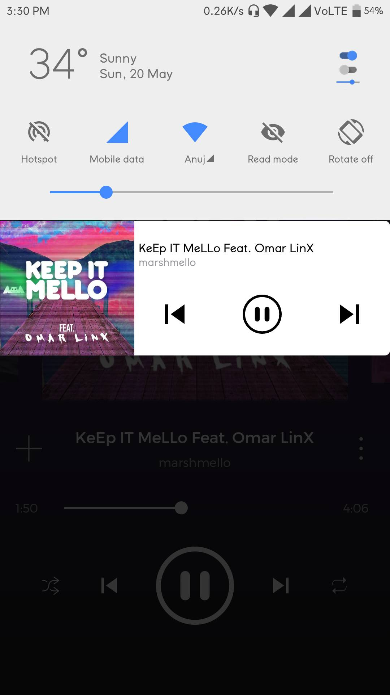
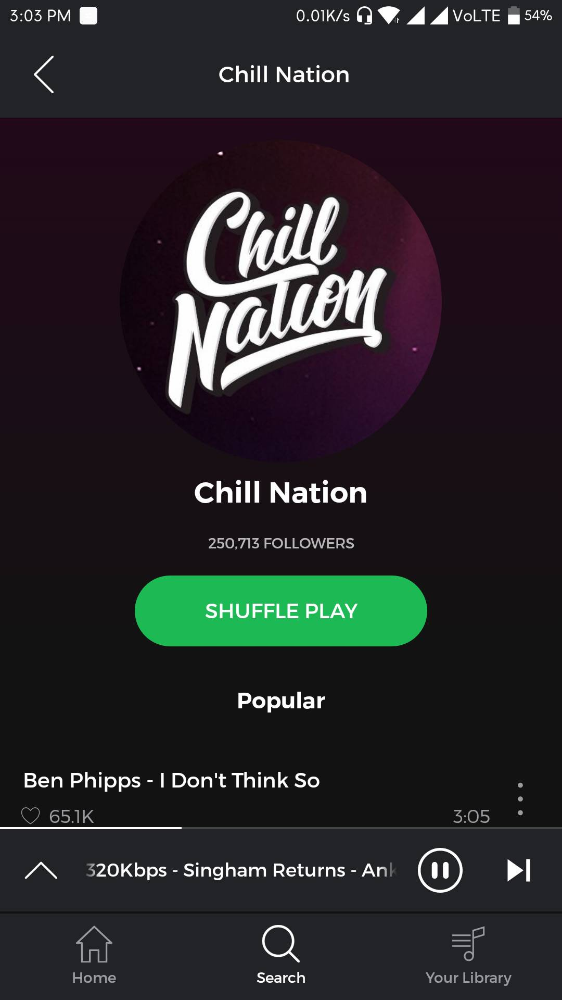
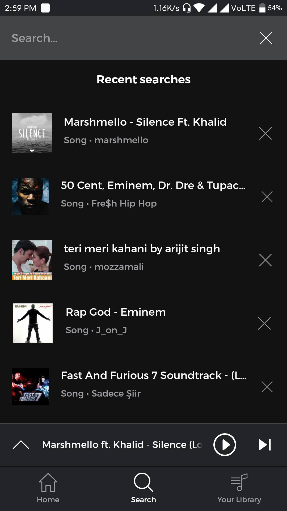
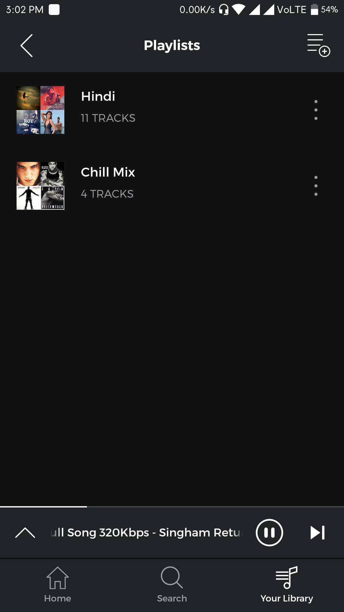
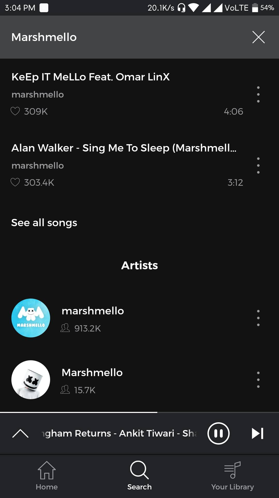

# Shuffler

An Android application that intelligently shuffles your favorite songs, predicting and playing the tracks you are most likely to want to listen to next. It leverages a custom Node.js backend integrated with YouTube Music to provide a seamless listening experience.

## 🎯 Objective
The main focus of Shuffler is to shuffle a user's music playlist in such a way that the next song played is highly tailored to their preferences. Various factors are taken into account while shuffling a saved playlist, including:
- Playback count
- Average playing duration
- Artist and Genre
- Release date
- User likes and interactions

## ✨ Features
- **Smart Shuffling**: Context-aware queue generation based on listening habits.
- **YouTube Music Integration**: Fetches tracks and metadata directly using a dedicated backend.
- **Background Playback**: Robust background audio playback using AndroidX Media3 (ExoPlayer).
- **Responsive UI**: Modern interface with artist profiles, saved playlists, search history, and dynamic media notifications.
- **Cross-Device Compatibility**: Dimensions optimized using `sdp-android` and `ssp-android` for a consistent experience across different screen sizes.

## 🛠️ Tech Stack

### Frontend (Android App)
- **Language**: Kotlin / Java (API 31+)
- **Media Playback**: AndroidX Media3 (ExoPlayer, MediaSession)
- **Networking**: Retrofit, OkHttp, Volley
- **Image Loading**: Glide
- **Concurrency**: Kotlin Coroutines
- **UI Components**: Material Design, RecyclerView, ViewPager, Palette API

### Backend (Node.js Server)
- **Framework**: Express.js
- **Music APIs**: `youtubei.js`, `ytmusic-api`, `@distube/ytdl-core`
- **Environment**: Node.js with `dotenv` and `cors`

## 🚀 Installation & Setup

### Prerequisites
- **Android Studio** (Koala or newer recommended)
- **Node.js** (v18+ recommended)
- **NPM** (Node Package Manager)

### 1. Backend Setup
The backend serves as a bridge between the Android app and YouTube Music.
1. Open a terminal and navigate to the `backend` directory:
   ```bash
   cd backend
   ```
2. Install dependencies:
   ```bash
   npm install
   ```
3. Start the server:
   ```bash
   # Development mode with hot-reload
   npm run dev
   # OR Production mode
   npm start
   ```
   *Note: Ensure the backend is running on a port accessible by your Android device/emulator.*

### 2. Android App Setup
1. Open the project in **Android Studio**.
2. Sync the project with Gradle files.
3. Configure the base URL in the app's networking client to point to your local or hosted Node.js backend (e.g., `http://<YOUR_LOCAL_IP>:<PORT>/`).
4. Build and run the app on an emulator or physical device running Android 12 (API 31) or higher.

## 🎥 Demo

You can interact with a legacy version of this Android app on Appetize.io [here](https://appetize.io/app/06wpw6dgrdg02v042qxrcjt1y8?device=nexus5&scale=100&orientation=portrait&osVersion=7.1&deviceColor=black).

### YouTube Demo
[](https://www.youtube.com/embed/syQZ8loBql4)

## 📸 Screenshots

<div align="center">
  
       
  
</div>
<br>
<div align="center">
  
  
  
</div>
